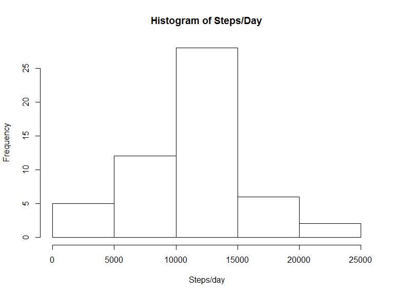
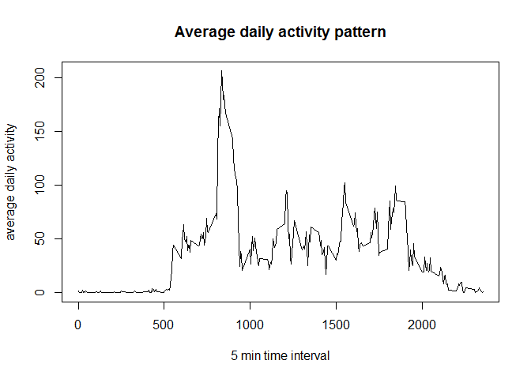
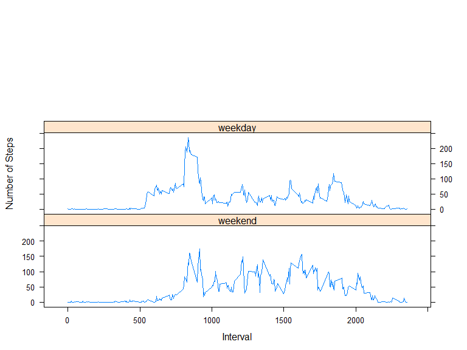

# Reproducible Research: Peer Assessment 1

## Loading and preprocessing the data

```r
download.file("https://d396qusza40orc.cloudfront.net/repdata%2Fdata%2Factivity.zip", "activity.zip")
unzip("activity.zip")
```


```r
getwd()
```

```
## [1] "C:/Users/abhibhat.ORADEV/Documents/RepData_PeerAssessment1"
```

```r
data_withna = read.table("activity.csv", header = TRUE, sep = ',')
data = data_withna[complete.cases(data_withna),]
head(data)
```

```
##     steps       date interval
## 289     0 2012-10-02        0
## 290     0 2012-10-02        5
## 291     0 2012-10-02       10
## 292     0 2012-10-02       15
## 293     0 2012-10-02       20
## 294     0 2012-10-02       25
```

```r
names(data)
```

```
## [1] "steps"    "date"     "interval"
```

```r
summary(data)
```

```
##      steps                date          interval     
##  Min.   :  0.00   2012-10-02:  288   Min.   :   0.0  
##  1st Qu.:  0.00   2012-10-03:  288   1st Qu.: 588.8  
##  Median :  0.00   2012-10-04:  288   Median :1177.5  
##  Mean   : 37.38   2012-10-05:  288   Mean   :1177.5  
##  3rd Qu.: 12.00   2012-10-06:  288   3rd Qu.:1766.2  
##  Max.   :806.00   2012-10-07:  288   Max.   :2355.0  
##                   (Other)   :13536
```

## What is mean total number of steps taken per day?
**Calculate the total number of steps taken per day**

```r
total_steps_per_day = aggregate(data$steps, 
                                by = list(data$date), 
                                sum)$x
total_steps_per_day
```

```
##  [1]   126 11352 12116 13294 15420 11015 12811  9900 10304 17382 12426
## [12] 15098 10139 15084 13452 10056 11829 10395  8821 13460  8918  8355
## [23]  2492  6778 10119 11458  5018  9819 15414 10600 10571 10439  8334
## [34] 12883  3219 12608 10765  7336    41  5441 14339 15110  8841  4472
## [45] 12787 20427 21194 14478 11834 11162 13646 10183  7047
```
**Make a histogram of the total number of steps taken each day**

```r
library(ggplot2)
hist(total_steps_per_day, 
     main = "Histogram of Steps/Day", 
     ylab = "Frequency", 
     xlab = "Steps/day")
```

 
**Calculate and report the mean and median of the total number of steps taken per day**
**mean**

```r
mean(total_steps_per_day)
```

```
## [1] 10766.19
```
**median**

```r
median(total_steps_per_day)
```

```
## [1] 10765
```
## What is the average daily activity pattern?
**Make a time series plot (i.e. type = "l") of the 5-minute interval (x-axis) and the average number of steps taken, averaged across all days (y-axis)**

```r
average_daily_activity_pattern = aggregate(data$steps, by = list(data$interval), mean)
head(average_daily_activity_pattern)
```

```
##   Group.1         x
## 1       0 1.7169811
## 2       5 0.3396226
## 3      10 0.1320755
## 4      15 0.1509434
## 5      20 0.0754717
## 6      25 2.0943396
```

```r
with(average_daily_activity_pattern, 
     plot(Group.1, 
          x, 
          type='l', 
          main = "Average daily activity pattern", 
          xlab = "5 min time interval", 
          ylab = "average daily activity"))
```

 

**Which 5-minute interval, on average across all the days in the dataset, contains the maximum number of steps?**

```r
average_daily_activity_pattern[which.max(average_daily_activity_pattern$x),]
```

```
##     Group.1        x
## 104     835 206.1698
```

## Imputing missing values
**Calculate and report the total number of missing values in the dataset (i.e. the total number of rows with NAs)**

```r
sapply(data_withna, function(x) sum(is.na(x)))
```

```
##    steps     date interval 
##     2304        0        0
```
**Devise a strategy for filling in all of the missing values in the dataset.**
***The Strategy we are adopting is to replace na of any day with the mean steps taken for that day***

**Create a new dataset that is equal to the original dataset but with the missing data filled in.**

```r
for(date in unique(data_withna$date))
{
    if(any(is.na(data_withna[data_withna$date == date,]$steps)))
    {
        data_withna[is.na(data_withna) & data_withna$date == date,]$steps =                mean(data_withna[data_withna$date == date,]$steps, na.rm = TRUE)
    }
}
```
**Make a histogram of the total number of steps taken each day and Calculate and report the mean and median total number of steps taken per day. **

```r
total_steps_per_day_withna = aggregate(data_withna$steps, 
                                by = list(data_withna$date), 
                                sum)$x
total_steps_per_day_withna
```

```
##  [1]   NaN   126 11352 12116 13294 15420 11015   NaN 12811  9900 10304
## [12] 17382 12426 15098 10139 15084 13452 10056 11829 10395  8821 13460
## [23]  8918  8355  2492  6778 10119 11458  5018  9819 15414   NaN 10600
## [34] 10571   NaN 10439  8334 12883  3219   NaN   NaN 12608 10765  7336
## [45]   NaN    41  5441 14339 15110  8841  4472 12787 20427 21194 14478
## [56] 11834 11162 13646 10183  7047   NaN
```
**Make a histogram of the total number of steps taken each day**

```r
library(ggplot2)
hist(total_steps_per_day_withna, 
     main = "Histogram of Steps/Day", 
     ylab = "Frequency", 
     xlab = "Steps/day")
```

 

** Do these values differ from the estimates from the first part of the assignment?**

```r
summary(total_steps_per_day_withna)
```

```
##    Min. 1st Qu.  Median    Mean 3rd Qu.    Max.    NA's 
##      41    8841   10760   10770   13290   21190       8
```

```r
summary(total_steps_per_day)
```

```
##    Min. 1st Qu.  Median    Mean 3rd Qu.    Max. 
##      41    8841   10760   10770   13290   21190
```
**What is the impact of imputing missing data on the estimates of the total daily number of steps?**

I do not see any visible impact.

## Are there differences in activity patterns between weekdays and weekends?

**Create a new factor variable in the dataset with two levels - "weekday"" and "weekend"" indicating whether a given date is a weekday or weekend day.**

```r
weeknames <- c('Monday', 'Tuesday', 'Wednesday', 'Thursday', 'Friday')
data$day <- factor((weekdays(as.Date(data$date)) %in% weeknames), 
                   levels=c(FALSE, TRUE), 
                   labels=c('weekend', 'weekday'))
```
**Make a panel plot containing a time series plot (i.e. type = "l") of the 5-minute interval (x-axis) and the average number of steps taken, averaged across all weekday days or weekend days (y-axis). See the README file in the GitHub repository to see an example of what this plot should look like using simulated data.**

```r
library(lattice)
average_daily_activity_pattern = aggregate(data$steps, 
                                           by = list(data$day, data$interval), 
                                           mean)
with(average_daily_activity_pattern, 
     xyplot(x ~ Group.2|Group.1, 
            type = 'l', 
            xlab = 'Interval',
            ylab = 'Number of Steps',
            layout=(c(1,3))))
```

 
